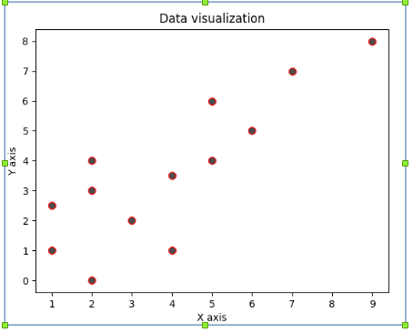
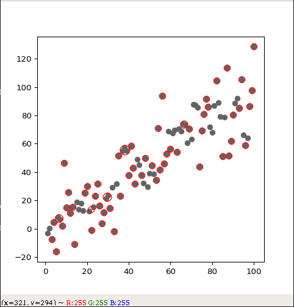
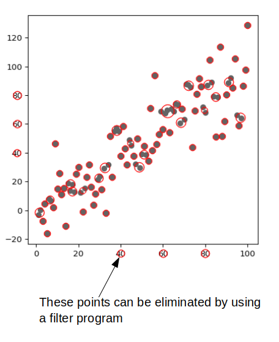
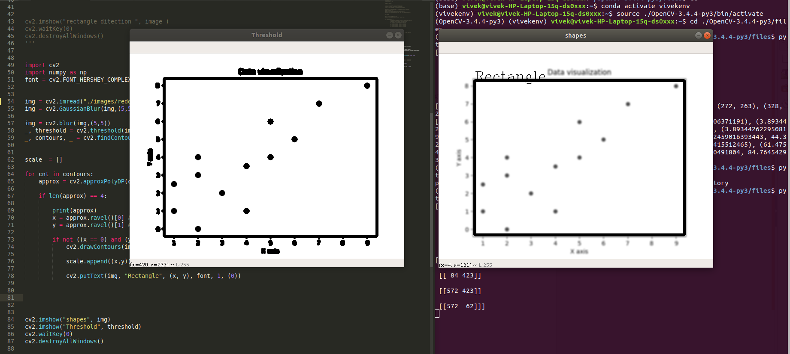

# Reconstruction-of-the-data-visualized-in-a-plot (scatter plot)
Python, opencv   

# INTRODUCTION

The data from a plot can be extracted  by various image processing methods  here we follow two main method 

1.Image Processing-based approach 
2.Machine Learning-based approach 

Here as the first approach, we go with Image processing based techniques. We have used python-OpenCV to extract the data from an image.

# Step1:- 
(Theory) Understanding the different plots, their use and how to plot them.Statistics of the data like Central Tendency, Measure of dispersion, Measure of association, etc. (This is for the analysis of the data before and after the process ) 
# Step2:- 
Understanding the use of different  commands and libraries for plotting the data(data visualization tools)
 (Here we are working with python - matplotlib for the data visualization )
# Step3:- 
Understanding the use of different image processing techniques, and Machine learning techniques and the comparison of both the techniques.
# Step4:-
Applying both of the techniques and analyzing the result to choose the final method or make the combination of both methods for the best results.

# Image Processing-based approach :
 
 
Take the image and find the points :
# Method1  : cv2.SimpleBlobDetector  and then  filterByCircularity 

Here in this method, we  try to find the circles(points) in the plot and get their locus,  but the method fails when  there are too many points in the plot (which results into the overlapping of the point and hence loss of circularity of the shapes)
Consider the example :
When there is no overlapping of the points :

When there is an overlapping of the points :

# Method2 (Modification) :

Here instead of going for the detection of the circularity(Which limits our method to detect only the plots which contain the data represented in the circular points, provided no overlapping ), we go for the area detection so the other methods like filterByArea, filterByConvexity, etc are used.
The result obtained needs little changes to get the final output, but the accuracy, versatility for the data, is definitely increased.

# Note :

To detect the exact points on the more generalized scale on the graph we have used the center shifting method P(x,y) = P(x-X, y-Y) where (X, Y) are the coordinates of the new center and this point can be detected as bottom left point of the following rectangle :

# Machine Learning-based approach

Different machine learning-based approaches are there, which can be used for the extraction of the information from an image or as a supportive method with the image processing to increase the accuracy.A relatively new computer vision model, called a Convolutional Neural Network ( the forefront of machine vision ) 
(CNN) can be used.CNN extracts latent meaning from images.

